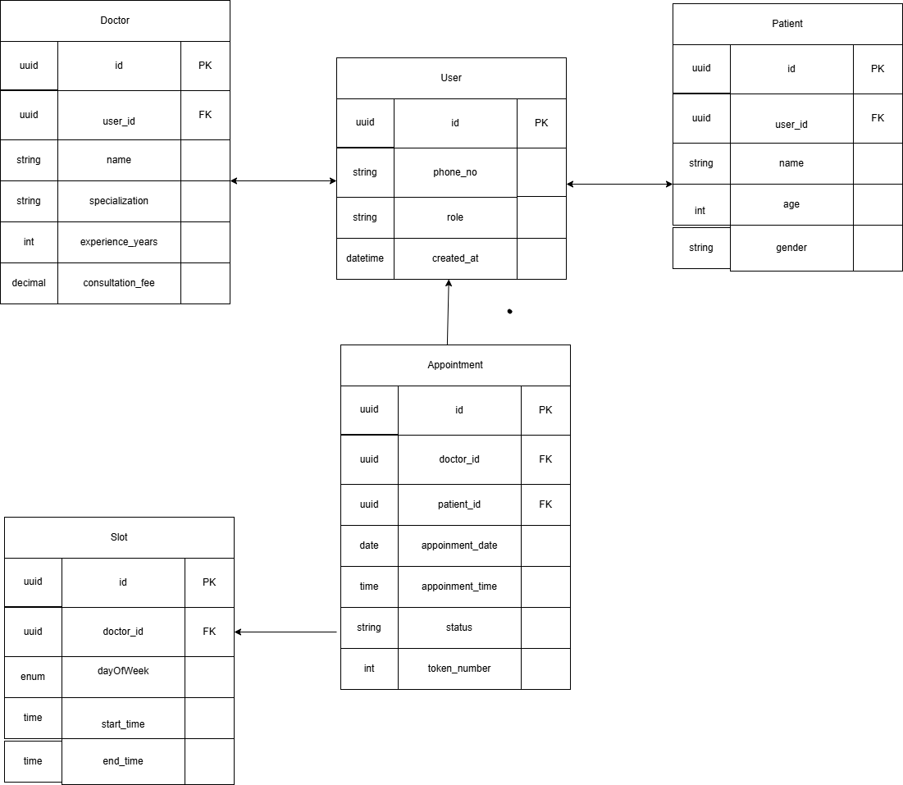

  

  A progressive <a href="http://nodejs.org" target="_blank">Node.js</a> framework
  for building efficient and scalable server-side applications.

---

## Description

This project is built using the **NestJS framework** and is focused on developing
a **Doctor–Patient Appointment Booking System**.

---

## Doctor & Patient Experience Flow

### Patient Experience Flow
1. Patient opens the application.
2. Patient signs up or logs in.
3. Patient selects a doctor.
4. Patient books an appointment.

---

### Doctor Experience Flow
1. Doctor signs up.
2. Doctor sets availability.
3. Doctor manages appointments.

---

### ER Diagram (Conceptual)

